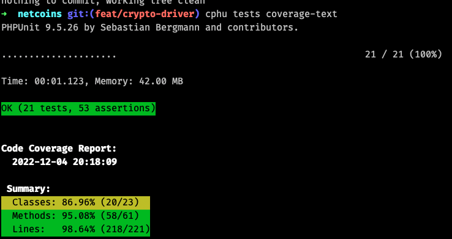

## Endpoints  
1. `api/v1/crypto/list`
    1. Query param `currency` (required);
1. `api/v1/crypto/price`
    1. Query param `crypto-currency` (required);
1. `api/v1/crypto/24h-price-range`
    1. Query param `crypto-currency` (required);

## Coverage
<p align="center"><p>

## Stack
- [PHP 7.4](https://www.php.net);
- [Laravel](https://laravel.com);
- [PHPUnit](https://phpunit.de/);
- [Docker](https://docker.com);

## Running the Application Locally
Steps:
1. ```shell
   git clone git@github.com:fnsc/netcoins.git
   ```
1. ```shell
   docker-compose build web --no-cache
   ```
1. ```shell
   docker-compose run web composer install
   ```
1. ```shell
   docker-compose up web -d
   ```
1. ```shell
   cp .env.testing ./.env
   ```

Finally access [http://localhost:8080](http://localhost:8080).
